# Portfolio — Giovanni Biancoli 🎮 💻


Ciao, benvenuto nel mio progetto Github!👋, Sono **Giovanni**⚡, studente DevOps, amante dell'informatica e di ogni tecnologia esistente.

Il mio **sito / portfolio**, pensato per raccontare il mio percorso verso lo sviluppo Fullstack con un parallelismo tra modalità di gioco e sezioni della mia vita/carriera. Il tema gaming è il *packaging*: sotto, i contenuti restano concreti e verificabili — percorso, competenze, progetti veri.

🔗 **Demo live:** https://sito-mio-portfolio.vercel.app

---

## Indice

- [Screenshot](#screenshot)
- [Perché questo concept](#perché-questo-concept)
- [Le 6 sezioni](#le-6-sezioni)
- [L'easter egg](#leaster-egg)
- [Stack](#stack)
- [Setup in locale](#setup-in-locale)
- [Come l'ho messo online](#come-lho-messo-online)
- [Cosa manca / prossimi passi](#cosa-manca--prossimi-passi)

---

## Screenshot

**_Singleplayer_** — il pannello di apertura con foto e stack tecnico
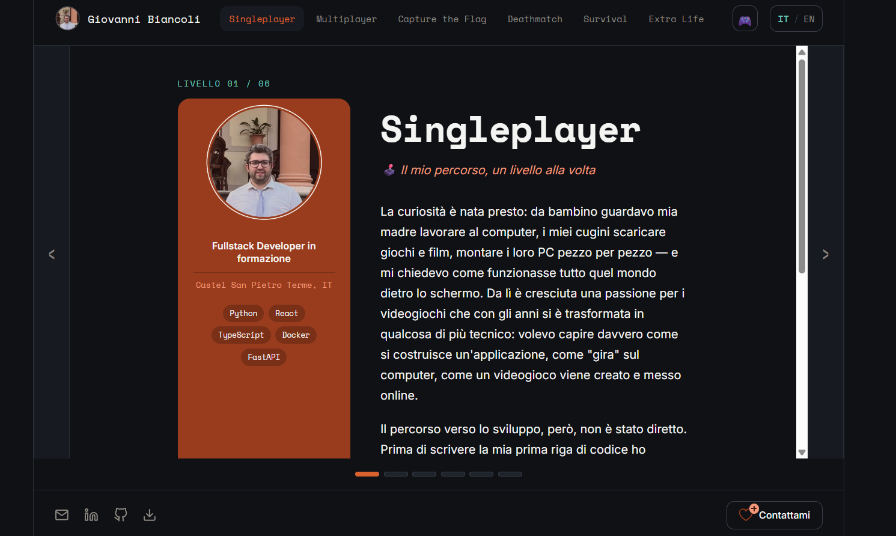

**_Multiplayer_** — soft skill e lavoro di squadra
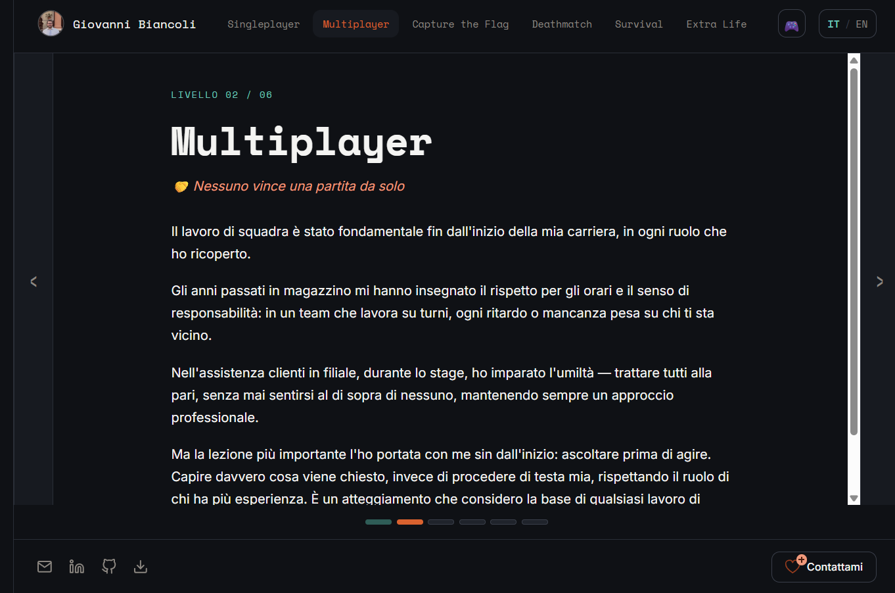

**_Capture the Flag_** — i progetti, con screenshot delle app vere
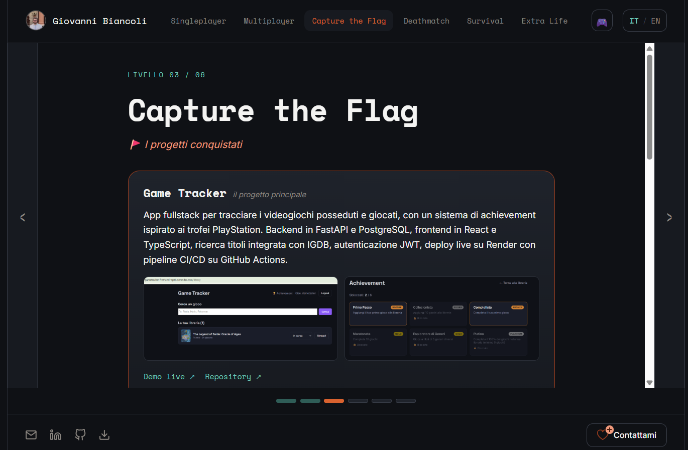

**_Deathmatch_** — i bug affrontati, raccontati per esteso
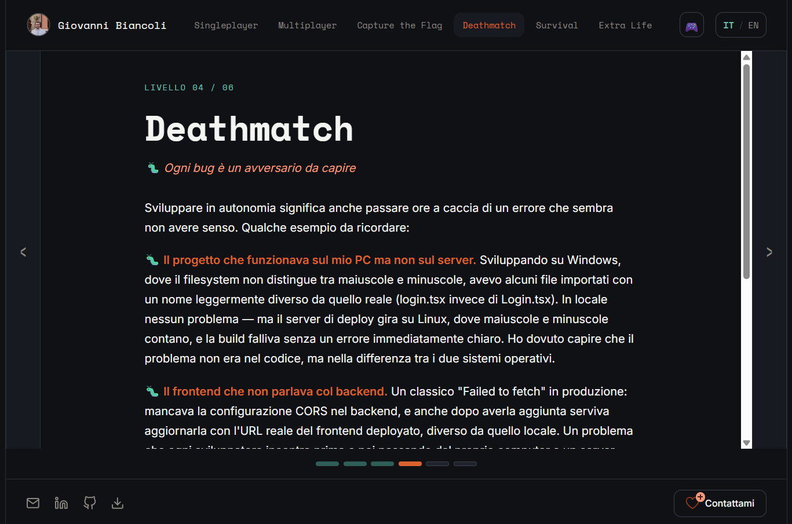

**_Survival_** — cosa sto imparando ora
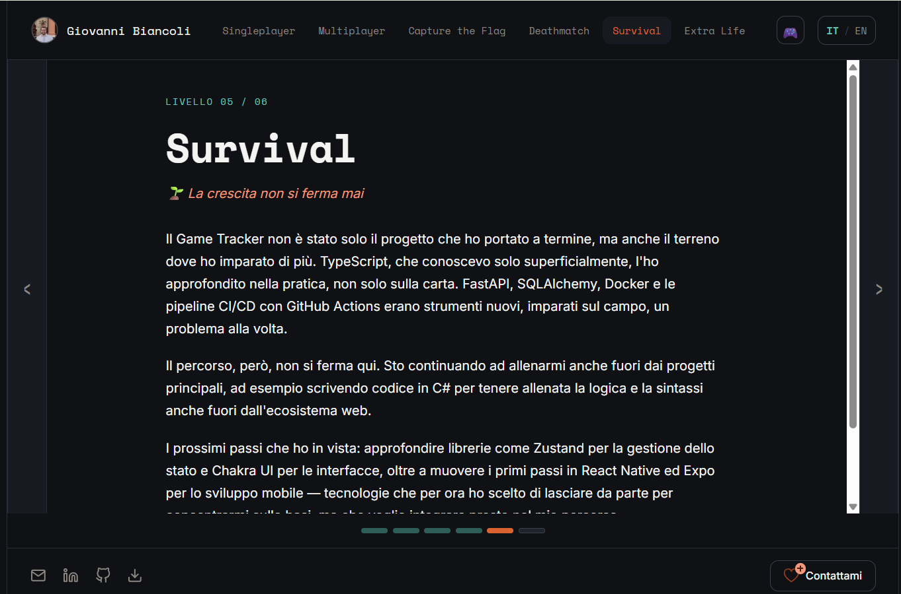

**_Extra Life_** — form di contatto, CV, link social
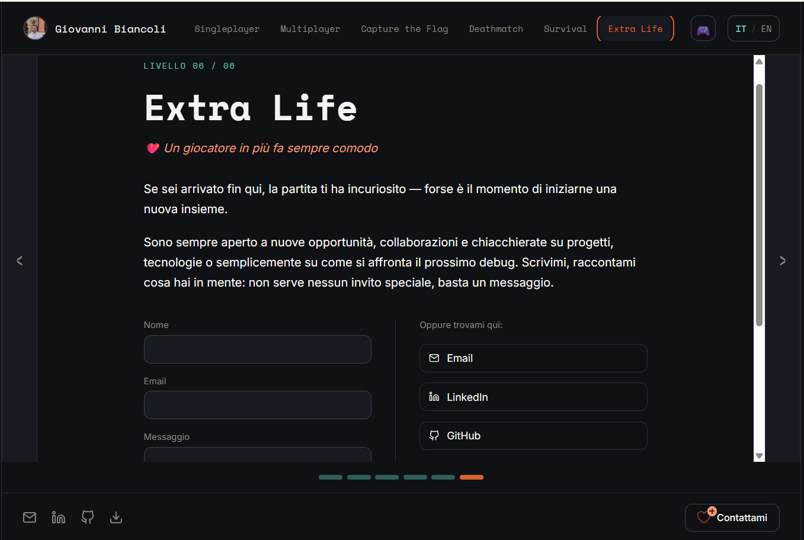

**_Il sito_** è interamente tradotto in inglese, **toggle** incluso
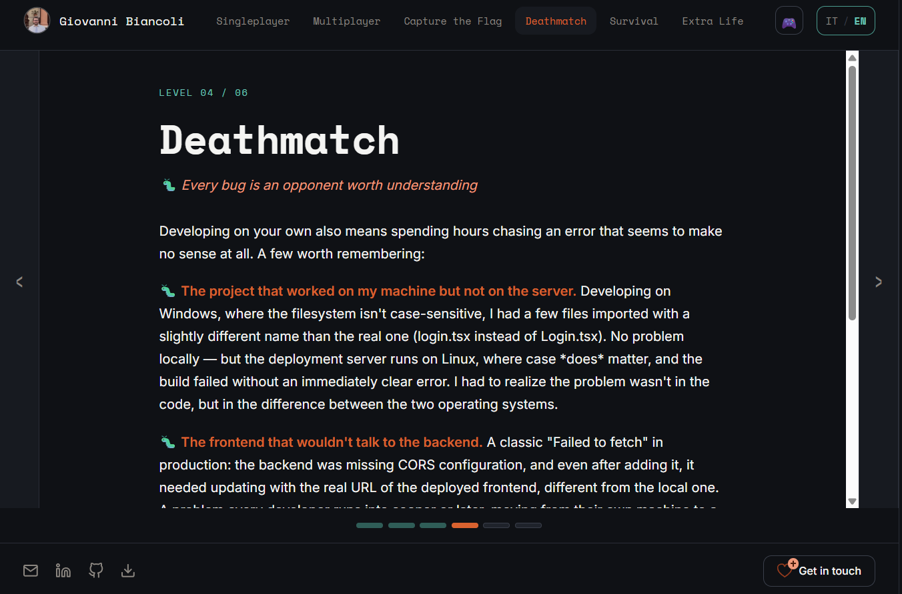

**_L'easter egg_** — un quiz lampo nascosto dietro l'icona del controller nell'header
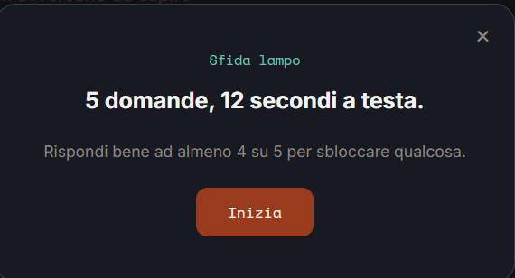

**_Il bottone email_** apre una scelta tra Gmail, Outlook e Yahoo, oltre alla copia diretta dell'indirizzo — nessun accesso a caselle di posta richiesto
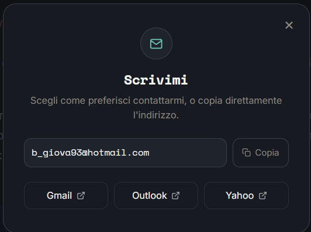

**_I tre CV_** (completo, sintetico, formato Europeo) si possono anche visualizzare in anteprima prima di scaricarli
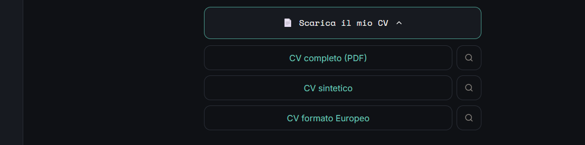

---

## Perché questo concept

Sono cresciuto con i videogiochi e la tecnologia, come passione, prima di trasformarla in un mestiere. Invece del solito portfolio a scroll verticale, ho voluto qualcosa che raccontasse anche *come* penso, non solo *cosa* so fare — da qui l'idea di sei sezioni in stile "modalità di gioco", navigabili come pannelli scorrevoli invece che con lo scroll classico.

## Le 6 sezioni

| Modalità | Contenuto |
|---|---|
| 🕹️ **Singleplayer** | Chi sono, il mio percorso, come sono arrivato allo sviluppo |
| 🤝 **Multiplayer** | Soft skill, lavoro di squadra |
| 🚩 **Capture the Flag** | I progetti, con screenshot e link a demo/repository |
| 🐛 **Deathmatch** | Problem solving, i bug veri che ho affrontato e come li ho risolti |
| 🌱 **Survival** | Cosa sto imparando ora, crescita continua |
| ❤️ **Extra Life** | Contatti — form, CV, link social |

## L'easter egg

Un piccolo quiz lampo (5 domande a tema dev/gaming, 12 secondi a testa) nascosto dietro l'icona del controller nell'header. Rispondendo bene ad almeno 4 su 5, si sblocca un piccolo "achievement" — un badge permanente nell'header e un messaggio di ringraziamento con un'animazione a tema (un omino pixel-art che pianta una bandierina "GG").

---

## Stack

**Frontend**
- React + TypeScript
- Framer Motion (transizioni tra sezioni, swipe su mobile)
- CSS puro con design token (nessun framework CSS esterno)
- Traduzione IT/EN completa, gestita via file di contenuto separati

**Backend** (per il form di contatto)
- FastAPI + SQLAlchemy
- PostgreSQL (Neon, piano gratuito)
- Notifica email automatica via Resend quando arriva un messaggio

**Deploy**
- Frontend su Vercel
- Backend su Render

---

## Setup in locale

### Frontend

```bash
npm install
npm run dev
```

Crea un file `.env` nella root (vedi `.env.example`) con l'URL del backend:

```
VITE_API_URL=http://localhost:8000
```

### Backend

```bash
cd backend
python -m venv venv
venv\Scripts\activate        # Windows
pip install -r requirements.txt
copy .env.example .env       # poi compila le variabili
uvicorn main:app --reload --port 8000
```

Dettagli tecnici del solo backend (endpoint, note di sicurezza) nel [README dedicato](./backend/README.md).

---

## Come l'ho messo online

Il processo reale seguito per portare questo portfolio dal codice al sito live — comandi inclusi, non solo teoria.

**Stack di deploy:** GitHub → Vercel (frontend) + Render (backend) + Neon (database PostgreSQL)

### 1. Caricare il progetto su GitHub

```bash
git init
git add .
git commit -m "primo commit"
git branch -M main
git remote add origin https://github.com/IlGiocatore93/sito-mio-portfolio.git
git push -u origin main
```

### 2. Database PostgreSQL su Neon

Render permette un solo database gratuito per account — essendo già occupato da un altro progetto, ho usato [Neon](https://neon.tech) come alternativa gratuita e separata.

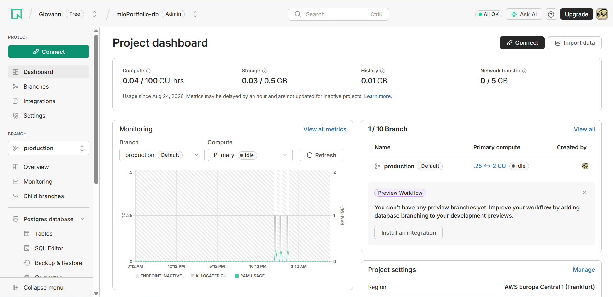

### 3. Backend su Render

Web Service collegato al repository GitHub:
- **Root Directory:** `backend`
- **Build Command:** `pip install -r requirements.txt`
- **Start Command:** `uvicorn main:app --host 0.0.0.0 --port $PORT`
- **Variabili:** `DATABASE_URL`, `RESEND_API_KEY`, `NOTIFY_EMAIL`, `FROM_EMAIL`, `FRONTEND_URL`

**Problema incontrato — versione Python troppo recente:** Render usava di default Python 3.14, per cui `pydantic-core` non aveva ancora un pacchetto pronto e provava a compilarlo da zero, fallendo per un problema di permessi del filesystem in sandbox. Risolto forzando `PYTHON_VERSION=3.11.9` come variabile d'ambiente.

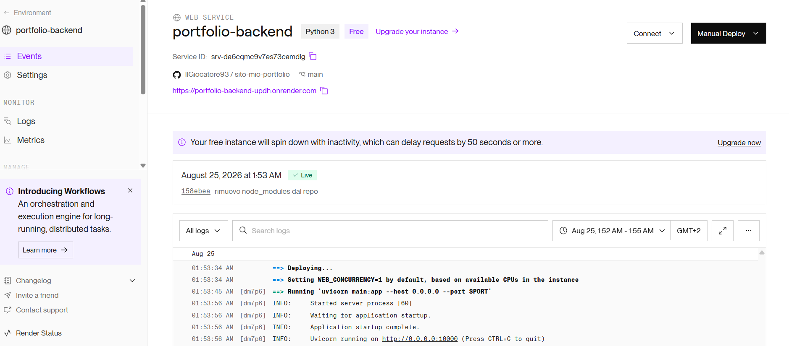

### 4. Frontend su Vercel

Progetto collegato allo stesso repository, framework preset **Vite**, variabile `VITE_API_URL` puntata all'URL del backend Render.

**Problema incontrato — permessi node_modules:** il primo deploy falliva con `Permission denied` su `tsc`. Causa: la cartella `node_modules` era finita per errore nel repository — passando da Windows a Linux, i file eseguibili al suo interno perdevano i permessi corretti.

```bash
git rm -r --cached node_modules
git commit -m "rimuovo node_modules dal repo"
git push
```

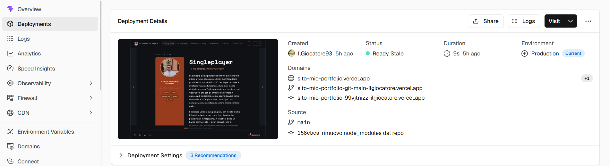

### 5. Collegare backend e frontend (CORS)

Tornati su Render, variabile `FRONTEND_URL` aggiornata con l'URL reale del frontend appena deployato. Render fa ripartire automaticamente il backend con il CORS corretto.

### 6. Test end-to-end

Form di contatto testato sul sito live: messaggio inviato dal browser → salvato nel database Neon → notifica ricevuta via email tramite Resend.

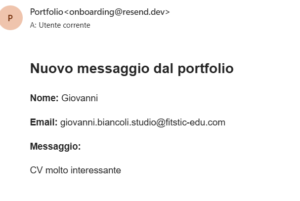

---

## Cosa manca / prossimi passi

- Dominio email personalizzato per le notifiche (per ora usa il dominio di test di Resend)
- Mini dashboard per consultare lo storico messaggi salvati nel database
- Possibili nuove domande per il quiz, per tenerlo fresco nel tempo

---

Creato da [Giovanni](https://github.com/IlGiocatore93)
